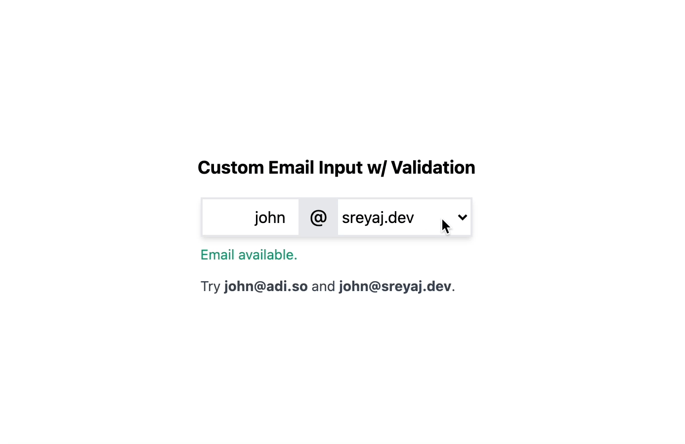

## Validations for Custom Form Elements

How to implement validations for Custom Form Elements made using `ControlValueAccessor`.

The approach we follow for get this working is a little bit different.

